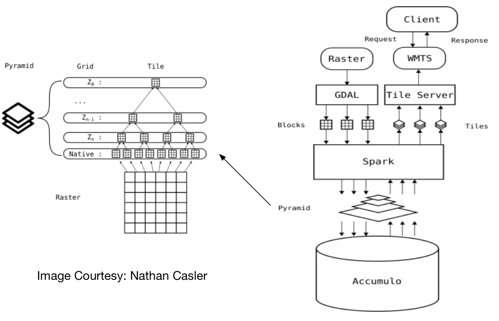



Data-Intensive Farm Management (DIFM)
------
To better understand how fertilizer management, soil characteristics, and weather dynamics affect crop yields in order to help farmers fertilize more efficiently with lower production costs and to achieve better environmental sustainability

Synthesizing Knowledge of Past Environments (SKOPE)
------
An online resource for paleoenvironmental data and models
Enabling scholars to easily discover, explore, visualize, and synthesize knowledge of environments in the recent or remote past

Scalable Raster Mapping and Analytical Service 
------
Provide near real-time visual analytic capabilities for exploration of large raster datasets (TB level).
Support raster data importing and partitioning, index building, and map tiling and resampling.

Enhancing Usability of High-resolution Topographic Datasets (TopoLens) 
------
Exploit HPC and Cloud environment on University supercomputer ROGER to support user-driven topographic data access.
Support community sharing and interoperable with ArcGIS Online.

CyberGIS-powered Biomass Supply Chain Management
------
A cyberGIS-enabled Spatial Decision Support System for biomass supply chain management.
Determine optimal location for growing bioenergy crops, facilities locations, and transportation patterns by minimizing 
biofuel production cost.

Bioenergy Knowledge Discovery Framework
------
Main project participated when I was an intern in Oak Ridge National Laboratory.
An online collaboration toolkit and data resource that provides access to the latest bioenergy research.

Resource Management and Mapping Service
------
A web GIS platform for managing and mapping water, soil, polluted runoff, land use and other related resources in 
Illinois,  sponsored by Illinois Environmental Protection Agency.
Developed based on ArcGIS API for Javascript, Microsoft SQL Server, and ArcGIS Server.

